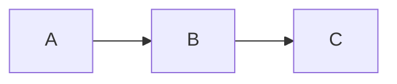

# How to write Markdown in Markup

This guide explains the Markdown features supported by Markup (the app), with examples and notes about special syntax (Mermaid, KaTeX, admonitions, backlinks, etc.). The app uses react-markdown \+ remark/rehype plugins (remark-gfm, remark-math, remark-supersub, remark-definition-list, rehype-katex, rehype-highlight, rehype-raw), mermaid, and node-emoji.

---

## Quick summary

Supported features:

1.  GitHub-Flavored Markdown (tables, task lists, strikethrough)
2.  Math (KaTeX): inline and display
3.  Mermaid diagrams
4.  Syntax-highlighted code blocks
5.  Admonitions using GitHub-style blockquote markers
6.  Backlinks using \[\[Page Title\]\]
7.  Emoji shortcodes (:smile:)
8.  Inline highlights with `==text==`
9.  Superscript (^x^) and subscript (~x~)
10.  Footnotes
11.  Definition lists (term: definition)
12.  Per-line inline editing behavior in the inline editor

---

## Quickstart

1. Open or create a document in Markup.
2. Type Markdown normally; the preview updates live (split view or standalone preview).
3. Use fenced code blocks for code and diagrams:

-  Mermaid diagrams: `mermaid ...`
-  Code blocks: `js ...`

---

## Examples and usage

### 1) Headings

```markdown
# H1

## H2

### H3

#### H4

##### H5

###### H6
```

### 2) Paragraphs, bold, italic, strikethrough

```markdown
**bold**

*italic*

~~strikethrough~~
```

### 3) Lists and task lists (GFM)

```markdown
- Item 1

- Item 2

- [x] Done task

- [ ] Open task
```

Task lists render checkboxes (export shows disabled checkboxes).

### 4) Tables (GFM)

```markdown
| Name  | Age |

|-------|-----|

| Alice | 28  |

| Bob   | 30  |
```

### 5) Code blocks and syntax highlighting

Use a fenced code block with the language to get syntax highlighting:

````markdown
```js

console.log("hello")

```
````

### 6) Mermaid diagrams

Use a fenced block with `mermaid`:

````markdown

````

Notes:

- Single-line mermaid diagrams with double-space separators are normalized by the preview (two spaces become newlines).
- If Mermaid fails, the preview shows an error block with the Mermaid error message.

### 7) Math (KaTeX)

-  Inline:
  ```markdown
  Euler's formula: $e^{i\pi} + 1 = 0$
  ```

- Block/display:
  ```text
  $$
  \int_0^\infty e^{-x}\,dx = 1
  $$
  ```

### 8) Emoji shortcodes

Emoji shortcodes are converted via node-emoji:

```markdown
I love this! :sparkles:
```

### 9) Inline highlight

Use `==` to create a highlight:

```markdown
This is ==important== text.
```

Renders as highlighted text (\<mark\>).

### 10) Superscript and subscript

- Superscript:

```markdown
X^2^
```

renders as X² (\<sup\>).

- Subscript:
  ```text
  H~2~O
  ```

renders as H₂O (\<sub\>).

The project uses remark-supersub for this behavior.

### 11) Footnotes

```markdown
Here is a footnote reference[^1].

[^1]: This is the footnote text.
```

Footnotes are collected and rendered with inline references and the footnote list on export/preview.

### 12) Definition lists

Use the definition list form supported by remark-definition-list:

```markdown
Term 1

: Definition 1

Term 2

: Definition 2
```

### 13) Admonitions (Note / Tip / Warning / etc.)

Use GitHub-style blockquotes with `[!TYPE]`:

```markdown
> [!TIP]

> Use this tip to do X.

> [!WARNING]

> This is a warning.
```

Supported types: NOTE, TIP, IMPORTANT, WARNING, CAUTION. The preview extracts the type and renders a styled admonition with an icon and label.

###  14) Backlinks (graph/refs)

Double-bracket references are parsed for backlink/graph features:

```markdown
See [[Project Plan]] for details.
```

Backlink extraction uses the pattern `\[\[([^\]]+)\]\]`. In previews these are typically shown as emphasized or as internal links depending on the view.

### 15) Inline editing & per-line preview

The inline editor renders each line as formatted Markdown when it loses focus; clicking/focusing a line returns it to raw Markdown for editing. Per-line preprocessing includes emoji and highlight conversion.

---

## Export & rendering details

When exporting, Markup's conversion includes:

- Footnotes collection and numbering
- Fenced code → `<pre><code class="language-...">`
- Inline code, headings, emphasis, and strikethrough handling
- Highlighting (==text== → `<mark>`)
- Superscript/subscript handling
- Image and link conversion
- Horizontal rules, task lists, tables conversion
- Admonition parsing from blockquote `[!TYPE]` into styled admonition blocks

Files in the codebase that show how this is implemented:

- `src/components/editor/markdown-preview.tsx` — main preview \+ preprocess \+ Mermaid block \+ admonition parsing
- `src/components/editor/markdown-preview-standalone.tsx` — standalone preview version
- `src/components/editor/inline-markdown-editor.tsx` — inline per-line renderer/preprocessor
- `src/components/editor/markdown-editor.tsx` — CodeMirror-based editor setup
- `src/components/shell/export-dialog.tsx` — `markdownToRichHtml` export logic
- `package.json` — shows dependencies (react-markdown, mermaid, rehype-katex, remark-gfm, etc.)

---

## Tips

- Mermaid: If you write a mermaid diagram as a single line, separate diagram parts with two spaces to let the preview normalize them to newlines.
- Mermaid errors show in the preview — check syntax on error.
- Raw HTML is processed (rehype-raw is enabled) — avoid embedding untrusted HTML in shared notes.
- Mermaid initializes with a relaxed security level to permit expected diagrams; be mindful if exposing user-supplied Mermaid in public/shared notes.
- Editor settings (auto-close, list continuation, tab handling) live in workspace settings and affect editing behavior (CodeMirror configuration).
- If you need a different export or to disable a plugin, check the preview components to see the remark/rehype pipeline.